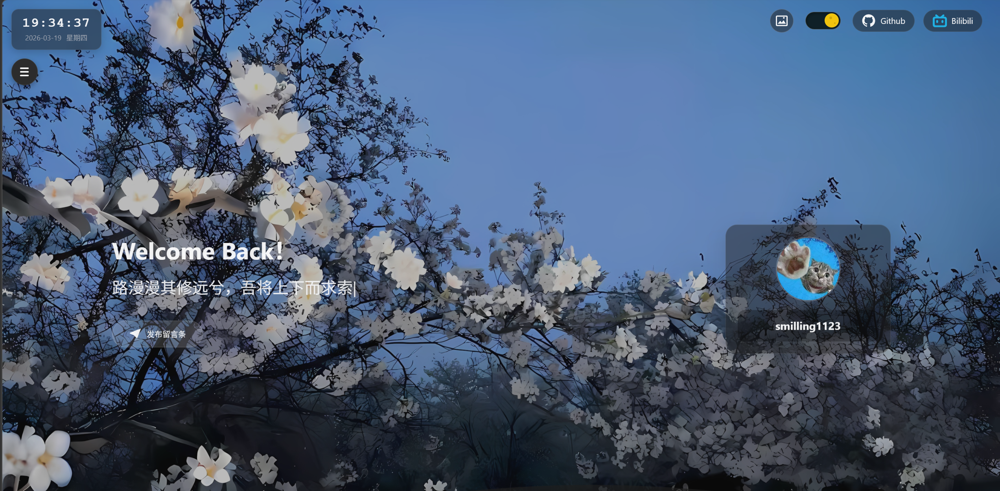

# PoloBlog

一个前后端分离的个人博客项目，包含博客前台、后台管理和 Spring Boot 后端。项目覆盖文章、评论、留言弹幕、作品展示、数据统计和第三方 OAuth 登录等常见博客能力。


## 项目概览

- 博客前台：文章展示、搜索、分类标签、留言弹幕、OAuth 登录
- 后台管理：文章、分类、标签、评论、留言、壁纸、作品、标语、数据看板
- 后端服务：认证鉴权、业务接口、文件上传、缓存与定时统计
- 我的博客；www.poloblog-smilling1123.cloud
## 技术栈

| 模块 | 技术 |
| --- | --- |
| 后端 | Spring Boot 3.3、MyBatis-Plus、Redis、JWT、JustAuth、MinIO |
| 博客前台 | Vue 3、Vite、Pinia、Element Plus |
| 后台管理 | Vue 3、Vite、Pinia、Ant Design Vue、G2Plot |
| 数据库 | MySQL 8 |
| 部署 | Docker Compose、Nginx |

## 项目结构

```text
.
├─ src/                          # Spring Boot 后端源码
├─ SQL/                          # 数据库初始化脚本
├─ BlogFrontEnd/FrontEnd/        # 博客前台
├─ BlogFrontEndBack/             # 后台管理
├─ deploy/                       # Docker / Nginx / 生产配置模板
├─ docs/                         # 项目文档
├─ pom.xml                       # 后端 Maven 配置
└─ .env.example                  # 环境变量模板
```

## 核心功能

- 文章：发布、编辑、搜索、分类筛选、标签筛选、热门文章
- 评论：根评论、子评论、回复链路、后台管理
- 留言墙：前台展示、后台删除、弹幕展示
- 站点内容：博主信息、壁纸、作品集、标语
- 数据统计：全站数据、每日统计、文章趋势
- 登录鉴权：管理员账号登录、Gitee/GitHub OAuth 登录
- 文件管理：MinIO 上传与访问

## 开发环境

- JDK `21`
- Maven `3.9+` 或仓库自带 `mvnw`
- Node.js `20+`
- pnpm `10+`
- MySQL `8.x`
- Redis `6+`
- MinIO `RELEASE.2024+`

## 快速开始

### 1. 初始化数据库

执行 [SQL/init.sql](./SQL/init.sql) 导入表结构和基础数据。

初始化脚本会写入两个测试账号：

- 管理员：`admin / 123456`
- 普通用户：`test / 123456`

建议导入后立即修改默认密码。

### 2. 配置后端

仓库中的 [application.yaml](./src/main/resources/application.yaml) 只保留了环境变量入口。

推荐复制本地模板：

```bash
cp src/main/resources/application-local.example.yml src/main/resources/application-local.yml
```

按实际环境填写：

- 数据库连接
- Redis 地址
- MinIO 账号
- OAuth Client ID / Secret
- `jwt.secret`

也可以直接参考 [.env.example](./.env.example) 使用环境变量方式。

### 3. 启动后端

在仓库根目录执行：

```bash
./mvnw spring-boot:run
```

Windows：

```powershell
.\mvnw.cmd spring-boot:run
```

后端默认地址：`http://localhost:8080`

### 4. 启动博客前台

```bash
cd BlogFrontEnd/FrontEnd
npm install
npm run dev
```

前台默认地址：`http://localhost:6678`

### 5. 启动后台管理

```bash
cd BlogFrontEndBack
corepack enable
pnpm install
pnpm dev
```

后台默认地址：`http://localhost:6600`

## 构建命令

后端：

```bash
./mvnw -DskipTests package
```

前台：

```bash
cd BlogFrontEnd/FrontEnd
npm run build
```

后台：

```bash
cd BlogFrontEndBack
pnpm build
```

## 部署

部署文档已拆分，推荐直接查看：

- [docs/deployment.md](./docs/deployment.md)

文档包含：

- Debian 12 + Docker Compose + Nginx 的完整部署流程
- 单域名路径分流方案
- HTTPS / Certbot 配置
- 前台、后台、后端、MinIO 的发布与检查步骤
- 常用运维命令

## 配置说明

后端当前会自动尝试加载本地覆盖文件：

- [application.yaml](./src/main/resources/application.yaml)
- `application-local.yml`（本地私有）

可提交模板：

- [application-local.example.yml](./src/main/resources/application-local.example.yml)
- [application-prod.example.yml](./src/main/resources/application-prod.example.yml)
- [.env.example](./.env.example)
- [deploy/.env.example](./deploy/.env.example)
- [deploy/backend-config/application-prod.example.yml](./deploy/backend-config/application-prod.example.yml)

## 文档入口

- 后端接口说明：[docs/backend-api.md](./docs/backend-api.md)
- 部署文档：[docs/deployment.md](./docs/deployment.md)

## 开发约定

- 前后台开发环境统一通过 `/api` 代理到后端 `8080`
- 需要登录的接口通过 `Authorization` 请求头传递 JWT，当前实现不要求 `Bearer ` 前缀
- 上传接口使用 `multipart/form-data`

## 注意事项

- 如果要部署到服务器，推荐 `Debian 12 + Docker CE + Nginx`
- 修改或二次分发请注明出处
